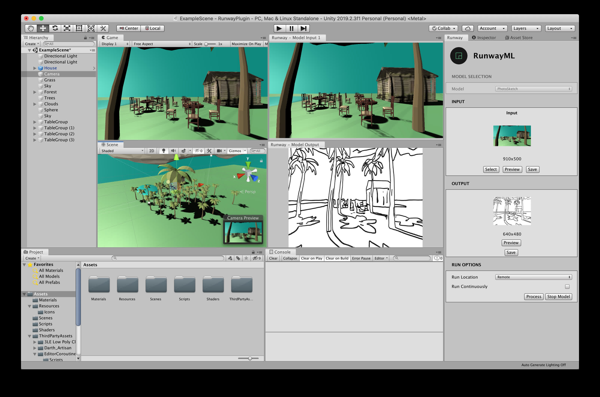
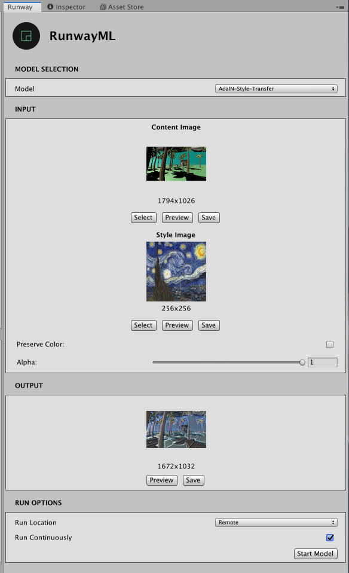

# Runway for Unity

Generate images, process textures, and create new rendering pipelines using machine learning models inside Unity.

### Prerequisites

* Download the latest release of [Runway](https://runwayml.com/download) and sign up for an account. Visit our [installation guide](https://learn.runwayml.com/#/getting-started/installation) for more details. If you encounter any issues installing Runway, feel free to contact us through the  [support page](https://support.runwayml.com).

* [Unity](https://unity3d.com/get-unity). Unity version 2019.2.3f1 or greater is required.

### Installation

There are two ways to use the Runway for Unity plugin.

* [Download the starter project](https://github.com/runwayml/unity-plugin/archive/master.zip), containing a simple scene to get you started as quickly as possible with Runway for Unity.

* Import the Runway for Unity scripts to your project. The latest `RunwayForUnity_{version}.unitypackage` is available in the [releases](https://github.com/runwayml/unity-plugin/releases) page. The `.unitypackage` contains the necessary scripts in order to use Runway models in Unity.

### Getting Started

First, you need to first launch the Runway application and sign in with your account.

[Download and unzip the Runway for Unity project](https://github.com/runwayml/unity-plugin/archive/master.zip). Import the project to Unity by opening Unity Hub and clicking on the `ADD` button next to `Projects` and selecting your project folder.

Once the project has been imported, click on the newly added project to launch the Unity Editor.

#### Using the Runway Panel

To interact with Runway inside Unity, you first need to open the Runway panel inside Unity. Click `Window` on the top menu and then `Runway` to open the Runway panel.

The Runway panel is split into five sections: the **(1) Model Selection**, **(2) Setup Options**, **(3) Input**, **(4) Output**, and **(5) Run Options**.

> Note: If you are seeing a `RUNWAY NOT FOUND` message instead of the view, ensure that the Runway application is running and that you are signed in.

#### (1) Model Selection

Here, you can select the Runway model that you'd like to use. To learn more about the capabilities and use-cases of different models in Runway, [watch our tutorial on discovering Runway models](https://www.youtube.com/watch?v=ePIRExcanjg).

#### (2) Setup Options

#### (3) Input

To explore the data types that are supported by Runway models, visit our [Runway SDK documentation](https://sdk.runwayml.com/en/latest/data_types.html).

##### Image Inputs

You can use any texture or camera as image input for your model. Click `Select` to choose any texture or camera to use as input for your model.

##### Segmentation Inputs

#### (4) Output

The model's output will be displayed here. Currently, only models that produce image-based outputs are supported.

#### (5) Run Options

There are two options to consider with regards to how your model is run:

**Run Location**: Choose whether to run the model locally (`Local`) or in Runway's cloud infrastructure (`Remote`). When running models in Runway's cloud infrastructure, you'll be running them on fast GPU enabled computers. When running models locally, you'll need to download and install them individually. You can currently download models locally only through the Runway application. Go to your `Settings` in Runway to view the currently installed models. Once you have installed a model locally, you can start the model from the Runway for Unity plugin.

**Run Continuously**: Check to keep processing the input with the selected model. Useful for performing continuous rendering when camera is selected as input.

Once you have selected the options for your model, click `Start Model` to run your model. Once the model is running, you can click `Process` to run inference on the current inputs using the model.

### Contributing

This is still a work in progress. Contributions are welcomed!
