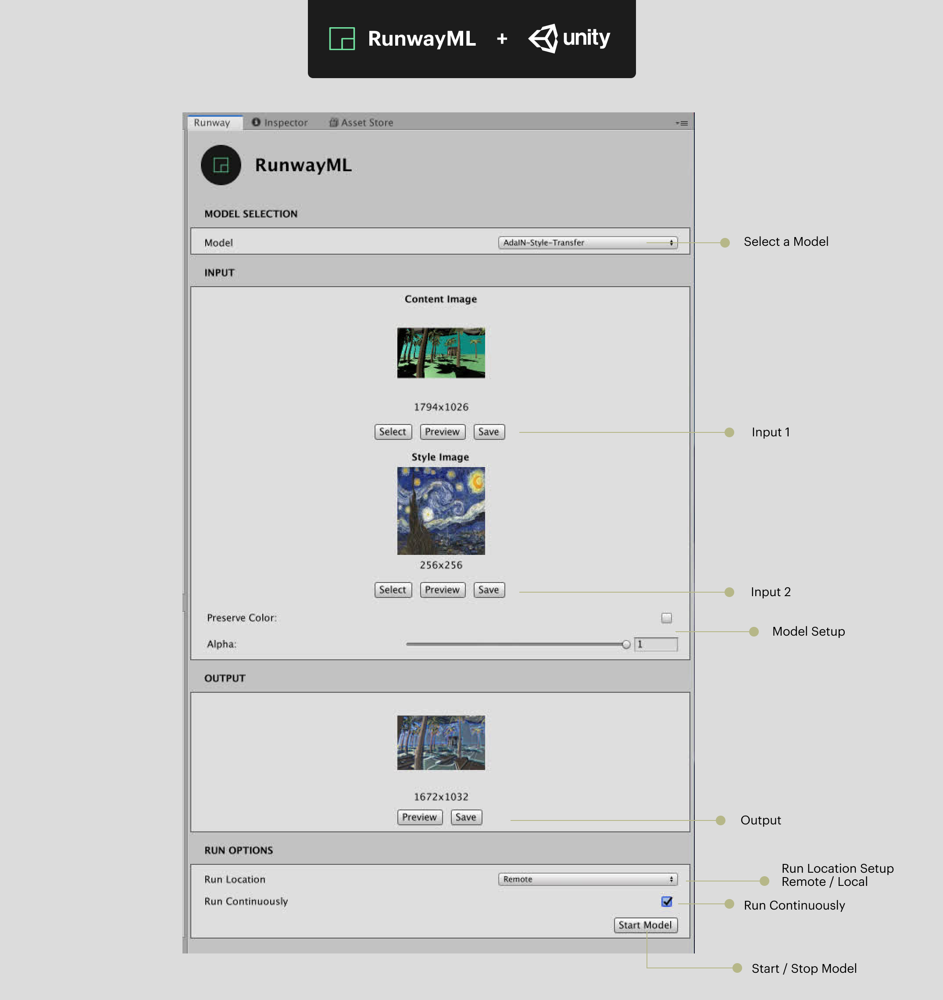

# RunwayML for Unity

Generate images, process textures, and create new rendering pipelines using machine learning models inside Unity.

## Prerequisites

* [RunwayML](https://runwayml.com/): Download the latest release of [RunwayML](https://runwayml.com/download) and sign up for an account. Visit our [installation guide](https://learn.runwayml.com/#/getting-started/installation) for more details. If you encounter any issues installing RunwayML, feel free to contact us through the [support page](https://support.runwayml.com).

* [Unity](https://unity3d.com/get-unity): Unity version 2019.2.3f1 or greater is required.

## Installation

There are two ways to use the RunwayML for Unity plugin.

1) [Download the starter project](https://github.com/runwayml/unity-plugin/archive/master.zip), containing a simple scene to get you started as quickly as possible with RunwayML for Unity. 
   
    or

2) Import the RunwayML for Unity scripts to your project. The latest `RunwayForUnity_{version}.unitypackage` is available in the [releases](https://github.com/runwayml/unity-plugin/releases) page. The `.unitypackage` contains the necessary scripts in order to use RunwayML models in Unity.

## Getting Started

First, you need to first launch the RunwayML application and sign in with your account.

Next, [download and unzip the RunwayML for Unity project](https://github.com/runwayml/unity-plugin/archive/master.zip). Import the project to Unity by opening Unity Hub and clicking on the `ADD` button next to `Projects` and selecting your project folder.

Once the project has been imported, click on the newly added project to launch the Unity Editor.

### Using the RunwayML Panel

To interact with RunwayML inside Unity, you first need to open the RunwayML panel inside Unity. Click `Window` on the top menu and then `Runway` to open the RunwayML panel.

The RunwayML panel is split into four sections: the **(1) Model Selection**, **(2) Input**, **(3) Output**, and **(4) Run Options**.

> Note: If you are seeing a `RUNWAY NOT FOUND` message instead of the view, ensure that the RunwayML application is running and that you are signed in.

### (1) Model Selection

Here, you can select the RunwayML model that you'd like to use, and select settings for initializing your model. To learn more about the capabilities and use-cases of different models in RunwayML, [watch our tutorial on discovering RunwayML models](https://www.youtube.com/watch?v=ePIRExcanjg).

### (2) Input

Choose the inputs that you want to process with your model. Currently, the following input data types are supported:

* [`image`](https://sdk.runwayml.com/en/latest/data_types.html#runway.data_types.image)
* [`segmentation`](https://sdk.runwayml.com/en/latest/data_types.html#runway.data_types.segmentation)
* [`category`](https://sdk.runwayml.com/en/latest/data_types.html#runway.data_types.category)
* [`number`](https://sdk.runwayml.com/en/latest/data_types.html#runway.data_types.number)
* [`boolean`](https://sdk.runwayml.com/en/latest/data_types.html#runway.data_types.boolean)

#### Image Inputs

You can use any texture or camera as image input for your model. 

Use `Select` to choose any texture or camera to use as input for your model. 
Use `Preview` to create a new window that displays the current content of your input. 
Use `Save` to save the current input content to disk.

#### Segmentation Inputs

For models that take `Segmentation` data type as input, RunwayML for Unity allows you to create segmentation maps from objects in your scene, where each object is encoded by a color based on one of the categories supported by the selected model.

To label objects with a specific category supported by the model, click on one or more objects in your scene. Then select the label you want to tag the objects with (e.g. tree), and click on the `Label selected objects` button. 

Use `Select` to choose any camera to use as input for your model. A segmentation map based on the camera display will be used as input.
Use `Preview` to create a new window that displays the current content of your input. 
Use `Save` to save the current input content to disk.

### (3) Output

The model's output will be displayed here. Currently, only models that produce image-based outputs are supported.

Use `Preview` to create a new window that displays the current content of your output. 
Use `Save` to save the current output content to disk.

### (4) Run Options

There are two options to consider with regards to how your model is run:

**Run Location**: Choose whether to run the model locally (`Local`) or in RunwayML's cloud infrastructure (`Remote`). When running models in RunwayML's cloud infrastructure, you'll be running them on fast GPU enabled computers. When running models locally, you'll need to download and install them individually. You can currently download models locally only through the RunwayML application. Go to your `Settings` in RunwayML to view the currently installed models. Once you have installed a model locally, you can start the model from the RunwayML for Unity plugin.

**Run Continuously**: Check to keep processing the input with the selected model. Useful for performing continuous rendering when camera is selected as input.

Once you have selected the options for your model, click `Start Model` to run your model. Once the model is running, you can click `Process` to run inference on the current inputs using the model.

## Acknowledgements

The `ImageSynthesis` and `ColorEncoding` script are modified versions of scripts from Unity's [Image Synthesis for Machine Learning](https://bitbucket.org/Unity-Technologies/ml-imagesynthesis/src/master/).

## Contributing

This is still a work in progress. Contributions are welcomed!
